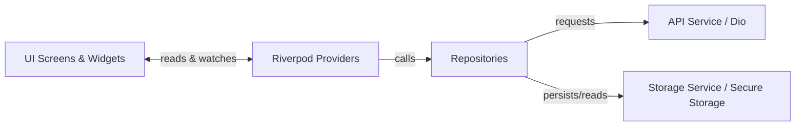
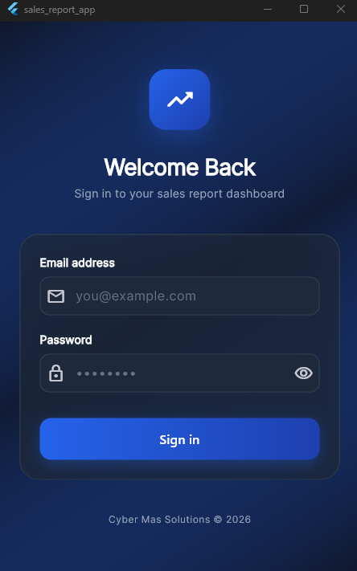
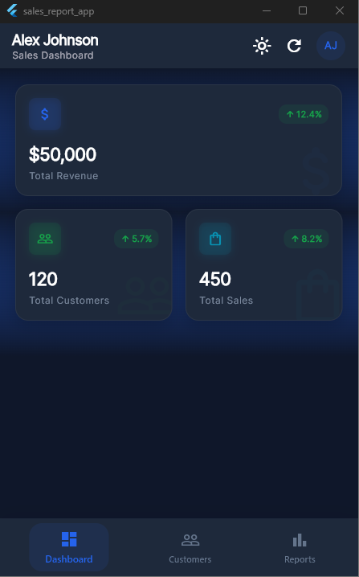
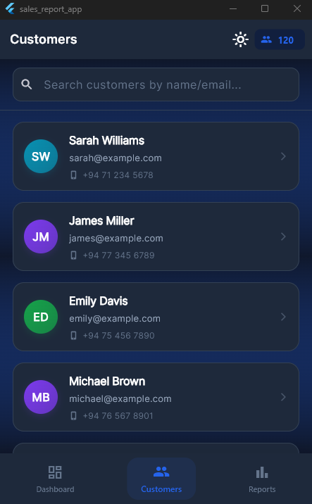
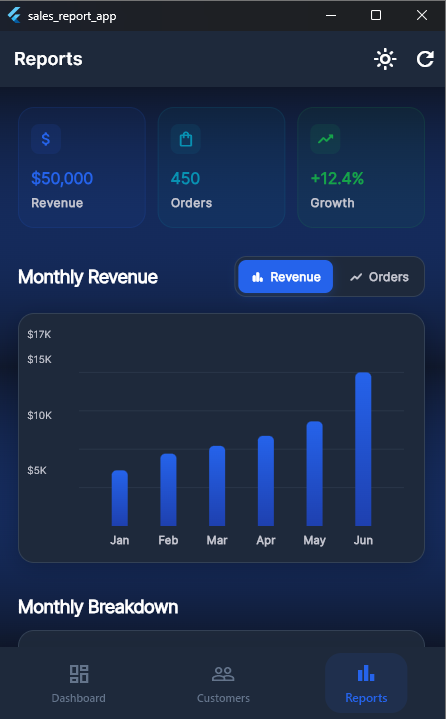
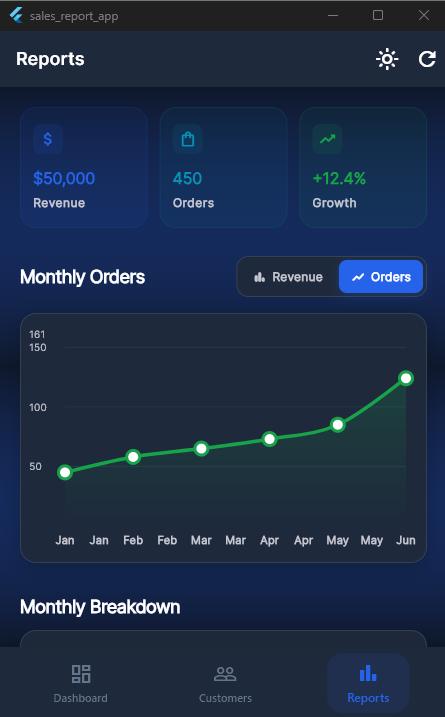
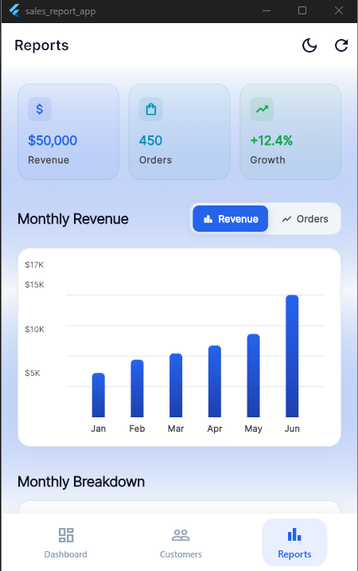

# Sales Reporting Mobile App 📊

A premium, high-performance Flutter mobile application built as part of the **Cyber Mas Solutions Flutter Developer Trainee Assessment**. This application serves as a comprehensive sales dashboard with real-time charting, paginated customer lists, robust auth state management, dynamic light/dark theme persistence, and an isolated unit/widget testing suite.

---

## 🚀 Setup Instructions

Follow these steps to get the application running on your local machine:

### Prerequisites
- **Flutter SDK**: `^3.19.0` or later stable version.
- **Dart SDK**: `^3.3.0`.
- **Target OS/Simulator**: Android Emulator / iOS Simulator / Web Browser / Desktop.

### Step-by-Step Installation

1. **Clone the Repository**
   ```bash
   git clone <repository-url>
   cd sales_report_app
   ```

2. **Install Dependencies**
   Fetch all required packages using the Flutter CLI:
   ```bash
   flutter pub get
   ```

3. **Verify Code Health**
   Run the static analyzer to confirm there are no compilation warnings or errors:
   ```bash
   flutter analyze
   ```

4. **Run Unit & Widget Tests**
   Execute the test suite to verify the mock API service, repository pagination logic, and login widget routing:
   ```bash
   flutter test
   ```

5. **Launch the Application**
   Run the app on a connected device or simulator:
   ```bash
   # Runs in debug mode
   flutter run

   # Runs in release mode (optimal performance)
   flutter run --release
   ```

6. **Build Release Packages (Optional)**
   Generate production-ready binaries:
   ```bash
   # Android APK
   flutter build apk --release

   # iOS App Bundle (macOS required)
   flutter build ipa
   ```

---

## 🏗️ Architecture Explanation

The application follows a **Clean Layered MVVM (Model-View-ViewModel)** architectural pattern. This guarantees separation of concerns, robust testability, and scalability.

```
lib/
├── models/            # Domain Models (pure data serialization/deserialization)
├── services/          # Data Sources (direct APIs, HTTP client, local database/storage)
├── repositories/      # Business Logic & Repository Layer (combines API & storage)
├── providers/         # ViewModels / State Management (notifiers exposing UI states)
├── screens/           # Views (UI pages: login, dashboard, customers, reports)
├── widgets/           # Reusable UI components (KPI cards, loaders, customer list tiles)
└── utils/             # Cross-cutting concerns (theme, router, formatters, constants)
```

### 1. Layers & Responsibilities
- **Views (Screens/Widgets)**: Declarative UI built using vanilla Flutter. They watch Riverpod providers to reactively redraw when state changes, and trigger events/actions back to providers.
- **ViewModels (Providers)**: Built using `flutter_riverpod`. ViewModels encapsulate screen-specific state (loading, error, list data). They use `AsyncValue` to handle asynchronous operations elegantly, preventing view redraw bugs.
- **Repository Layer**: Acts as a single source of truth for the ViewModels. The repositories decide whether to serve cached data from the `StorageService` or fetch fresh data from the `ApiService`, decoupling network logic from state management.
- **Service Layer**: 
  - **ApiService**: Encapsulates network operations using `Dio`. It manages API headers, request/response timeouts, response interceptors (such as auth token injection), and mapping of HTTP status codes to custom exceptions.
  - **StorageService**: Handles local data persistence. Sensitive credentials (auth token) are stored in secure OS-level keychain storage, while non-sensitive preferences (current user session data, theme modes) are written to fast persistent key-value store.

### 2. State Management Justification (Why Riverpod?)
As required by the assessment, Riverpod was chosen over standard Provider or Bloc for the following architectural benefits:
- **Compile-time Safety**: Eliminates common runtime errors (such as `ProviderNotFoundException`) by defining providers as global constants.
- **No BuildContext Dependency**: Allows reading/watching state inside repository and service layers without coupling logic to widget contexts.
- **Ease of Testing**: Providers can easily be overridden with mock implementations in unit and widget tests using `ProviderScope` overrides, eliminating the need to construct complex mock widget trees.
- **AsyncValue Support**: Native support for loading, error, and data states, making UI reaction to API calls highly concise and elegant.

### 3. Data Flow Diagram


---

## 💡 Assumptions Made

During the development of this application, several technical and business design assumptions were made to align with assessment requirements:

1. **Mock API Interceptor Fallback**
   - *Assumption*: Since a hosted live endpoint wasn't provided, we assume the host `https://api.cybermassolutions.com/v1` is resolved by a built-in `MockInterceptor` in our Dio configuration. This interceptor yields realistic mock responses mimicking network lag and status codes.
   - *Impact*: Allows full local simulation of features (like dashboard metrics, reports, pagination) with no internet access or external API dependency.

2. **Security & Session Persistence**
   - *Assumption*: The auth token should be secure and persist after the app closes. 
   - *Impact*: We assume a hybrid storage model where the token resides in `flutter_secure_storage` (backed by iOS Keychain/Android Keystore) and non-sensitive user metadata sits in `shared_preferences`.

3. **Theme Management Mode**
   - *Assumption*: The app should load the device's system theme by default but let the user manually override it.
   - *Impact*: We store user theme choice ('light' or 'dark') in `shared_preferences`. Tapping the Sun/Moon toggle icons in the AppBar stores the manual preference, overriding the system defaults immediately.

4. **Pagination Window size**
   - *Assumption*: Large datasets for customers should load dynamically without degrading UI performance.
   - *Impact*: We assume a standard page size of 20 customers. Pagination is triggered automatically when the user scrolls within 200 pixels of the bottom of the customer list view.

---

## 📸 Screenshots

All screens showcase the premium dark/light mode UI with smooth animations, real-time charts, and paginated customer lists.

### 🔐 Login Screen
<p align="center">
  
</p>

> Secure sign-in with email & password. Credentials are persisted via `flutter_secure_storage`.

---

### 🏠 Dashboard
<p align="center">
  
</p>

> Real-time KPI cards showing **Total Revenue ($50,000)**, **Total Customers (120)**, and **Total Sales (450)** with percentage growth indicators.

---

### 👥 Customers Screen
<p align="center">
  
</p>

> Paginated customer list (20 per page) with infinite scroll, live search by name/email, and total count badge.

---

### 📊 Reports Screen

<p align="center">
  
  &nbsp;&nbsp;
  
</p>

> Interactive bar chart for **Monthly Revenue** and line chart toggle for **Monthly Orders**. Includes summary KPI cards for Revenue, Orders, and Growth.

---

### 🌗 Light & Dark Theme

<p align="center">
  
</p>

> One-tap theme toggle between Light and Dark modes. User preference is persisted across sessions via `shared_preferences`.

---

## 🛠️ Main Dependencies Used

- **`flutter_riverpod`**: Robust, compile-safe state management.
- **`go_router`**: Declarative routing system supporting deep linking and redirection guards.
- **`dio`**: Powerful HTTP client with support for custom interceptors, request cancellation, and global configuration.
- **`fl_chart`**: Modern, highly customizable data charts.
- **`flutter_secure_storage`**: Secure credential encryption.
- **`shared_preferences`**: Local key-value storage for app configurations.
- **`intl`**: Currency and date formatting utility.
- **`shimmer`**: Graceful loading skeleton animations.

## 👤 Submitted By
 
**Muhammed Naveeth**
Flutter & Full Stack Developer
 
- 🌐 Portfolio: [my-portfolio-naveeth.vercel.app](https://my-portfolio-naveeth.vercel.app)
- 💼 LinkedIn: [linkedin.com/in/muhammed-naveeth](https://www.linkedin.com/in/muhammed-naveeth)
- 🐙 GitHub: [github.com/JMNaveeth](https://github.com/JMNaveeth)